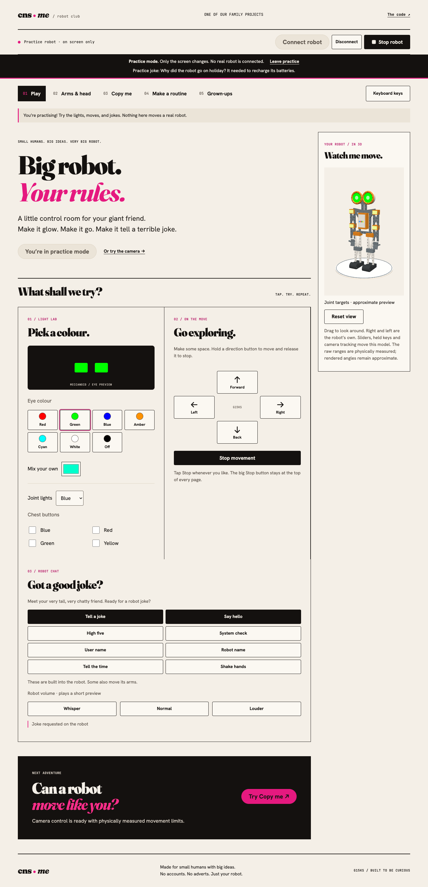
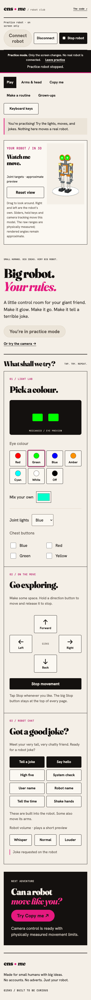
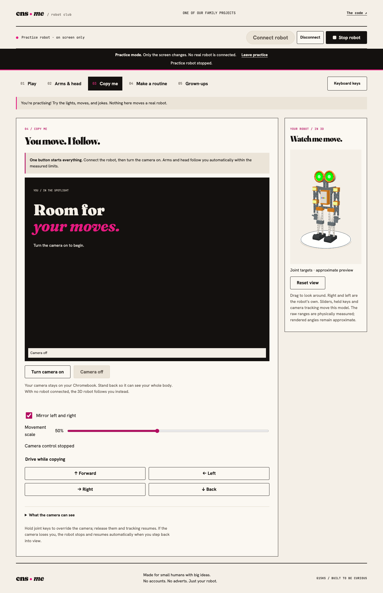
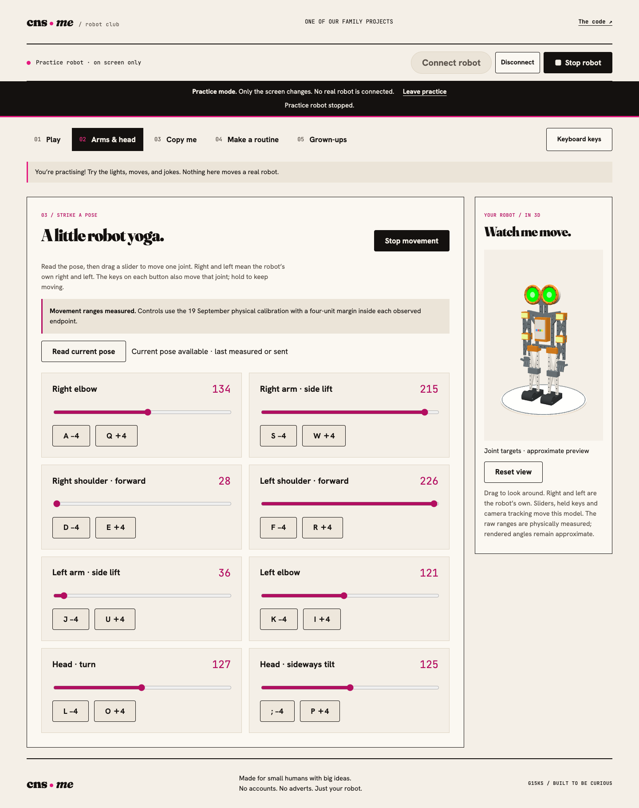

# Robot club · Meccanoid G15KS

[](https://github.com/chrisns/meccanoid/actions/workflows/pages.yml)

**A little control room for a very big robot.** Made for curious kids, Chromebook browsers, and a Meccanoid G15KS.

[Open Robot club](https://chrisns.github.io/meccanoid/) · [Try practice mode](https://chrisns.github.io/meccanoid/?practice=1) · [Protocol notes](docs/protocol.md)



## Have a play

1. Open the app in **Chrome on your Chromebook**. Practice mode needs no robot.
2. For the real thing, charge its battery, unplug USB, and turn it on. Only one browser can control it at a time.
3. Tap **Connect robot**, choose **MECCANOID**, and press its yellow button if it asks.
4. Pick an eye colour. Hold a direction button or arrow key to drive; release it to stop. **Stop robot** stays at the top of every activity.

School-managed Chromebooks may need Bluetooth/camera permission from an administrator. Web Bluetooth requires HTTPS (provided by Pages), or localhost for development. [Chrome's supported platforms and permissions](https://developer.chrome.com/docs/capabilities/bluetooth).

## See your robot move

An interactive **3D G15KS-style robot** sits beside the controls. Drag to orbit or use Reset view. Its eight joints follow slider and keyboard targets; eye and chest colours follow light commands. Wheel commands spin the preview wheels. Raw limits come from the physical robot; the rendered geometry and angles remain an approximate illustration rather than physical feedback.

In **Copy me**, connect the robot and press **Turn camera on**. That single action reads its pose, enables motion and starts controlling all eight joints. Hold a direction button there, or an arrow key, to drive while the camera stays on; release to stop. Without Bluetooth, the same camera movement drives the 3D robot only. There is no separate neutral, start or apply step. Losing tracking stops physical commands; stepping back into view resumes them.

**Keyboard:** hold arrow keys to drive and release to stop. Joint +/− pairs, in order: right elbow **Q/A**, right lift **W/S**, right shoulder **E/D**, left shoulder **R/F**, left lift **U/J**, left elbow **I/K**, head turn **O/L**, head tilt **P/;**. Keys work during camera control: a held joint key overrides tracking, and release hands that joint back to the camera. The on-page guide shows every shortcut. **Esc** stops everything anywhere; **Space** does so outside text fields. Losing window focus stops motion. The next deliberate movement automatically enables the internal motion guard again.

## Five places to explore

| Activity | What it does |
| --- | --- |
| **Play** | Live eye/joint/chest lights, press-and-hold driving, introductions, jokes, and volume controls. |
| **Arms & head** | Eight live sliders and hold-to-move joint controls. Targets stay put while motors catch up. |
| **Copy me** | One-button local camera control for the robot or the on-screen 3D preview. |
| **Make a routine** | Named poses and up to a minute of recorded joint movements; JSON import/export. |
| **Grown-ups** | Calibration, hand capture, sound bank, clock, component checks, and connection log. |

All eight joint identities and comfortable hand-moved ranges were physically measured on 19 September 2026. Observed raw ranges were 24–232 for five arm joints and head turn, 24–229 for left side lift, and 67–183 for sideways head tilt. Automatic controls use limits four raw units inside those endpoints. The measured neutral is `[134, 215, 28, 226, 36, 121, 127, 125]`; generic 128 centres were wrong for this build. When the measured defaults replace an older calibration, the previous settings are kept in local storage as `meccanoid.calibrationBeforeMeasured` (or `practice.meccanoid.calibrationBeforeMeasured`).

Practice mode is explicitly labelled, uses an in-memory robot, and never requests Bluetooth. Its saved poses and calibration are separate from the real robot's. It illustrates commands; it does not simulate the robot's mechanics or verify wiring.

<table><tr><td width="30%"></td><td><br></td></tr></table>

Screenshots show the app's **practice mode**, not a connected physical robot.

## Privacy and design

No accounts, adverts, analytics, camera uploads, computer speech, or audio-file playback. Video inference runs in a browser worker; fonts, model, and runtime load from this site. Hosting still involves normal web requests to GitHub Pages. Poses/calibration stay in local browser storage unless you export them. Robot chat uses only the firmware's built-in voice actions.

Uses the actual [CNS design system](https://github.com/chrisns/design) behind [blog.cns.me](https://blog.cns.me), [talks.cns.me](https://talks.cns.me), and [govbuy.run.cns.me](https://govbuy.run.cns.me): Fraunces, Hanken Grotesk, JetBrains Mono, cream paper, warm ink, and hot pink. Large labelled controls, keyboard focus, reduced-motion support, and responsive layouts make it easier to use with fingers or a trackpad.

## Run locally

```sh
npm ci
npm start
```

Open http://localhost:8080. Requires Node.js 22+. `npm start` builds the same static artifact used on Pages. Rebuild after source edits.

```sh
npm test                 # protocol, motion, transport and diagnostic tests
npm run build            # explicit public-file allowlist → dist/
npx playwright install chromium
CI=true npm run test:controls
CI=true npm run test:browser
CI=true npm run test:preview # keyboard, stop behaviour and 3D rendering
CI=true npm run test:camera  # official human video, cropped to a close webcam view; requires FFmpeg
CI=true npm run test:ui   # accessibility, responsive layouts, practice, screenshots
```

Keep the local server running during browser tests. Without `CI=true`, tests use installed Google Chrome. `APP_URL` can target a different local URL; CI serves `/meccanoid/` to catch project-path errors, including camera worker/model loading.

## CI and publishing

[GitHub Actions](.github/workflows/pages.yml) scans for secrets, installs locked dependencies, replays an official human movement video through the camera model, runs the unit and browser suites, checks accessibility and five screen widths, and uploads screenshots. Only a successful `main` build deploys its tested `dist/` artifact to GitHub Pages. Pull requests run checks without publishing. Actions are pinned to commit hashes; deployment uses GitHub's short-lived token, with no personal deployment secrets.

The public repo contains source, tests, documentation, screenshots, and the camera model. It excludes local session logs, environment files, dependency directories, and reverse-engineered app binaries. See [third-party notices](THIRD_PARTY.md) and [MIT licence](LICENSE).

## For tinkerers

- [JavaScript library and local CLI guide](docs/development.md)
- [Bluetooth packets and handshake](docs/protocol.md)
- [Hardware observations and verified joint map](docs/hardware-2026-09-18.md)
- [Tracking approach](docs/tracking.md)

A successful Bluetooth write is not proof of a physical response. If the browser or radio connection disappears, it cannot guarantee another stop packet will arrive. Keep the robot's power switch within reach during physical testing.
